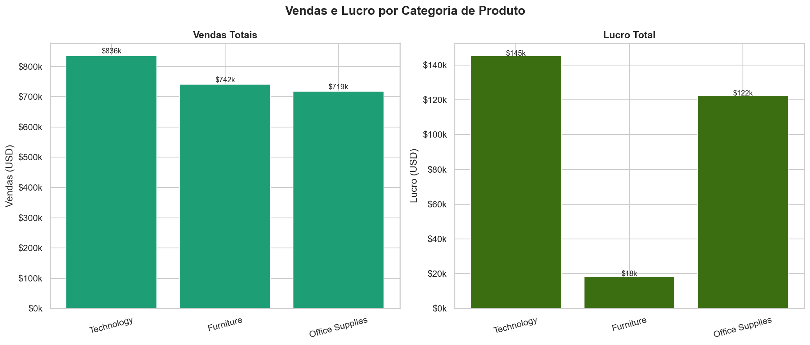
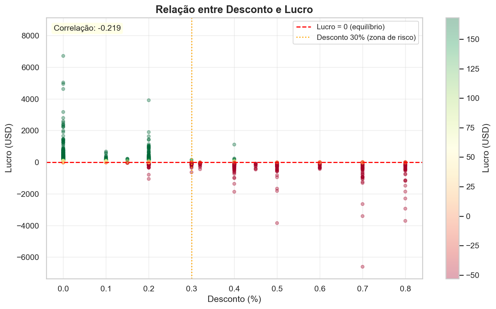
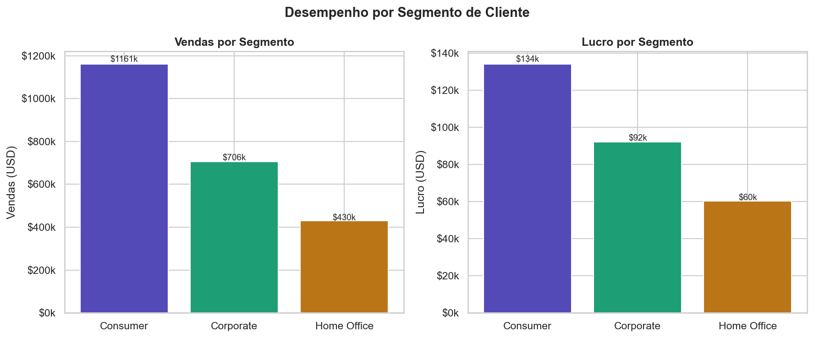
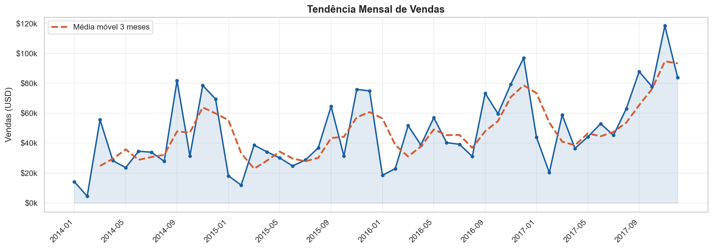
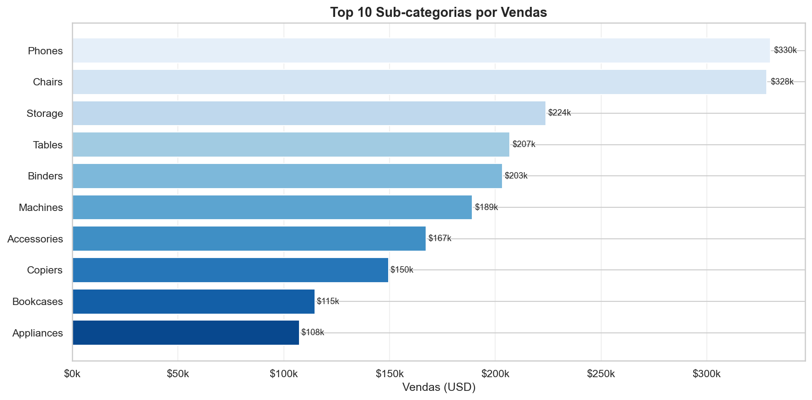
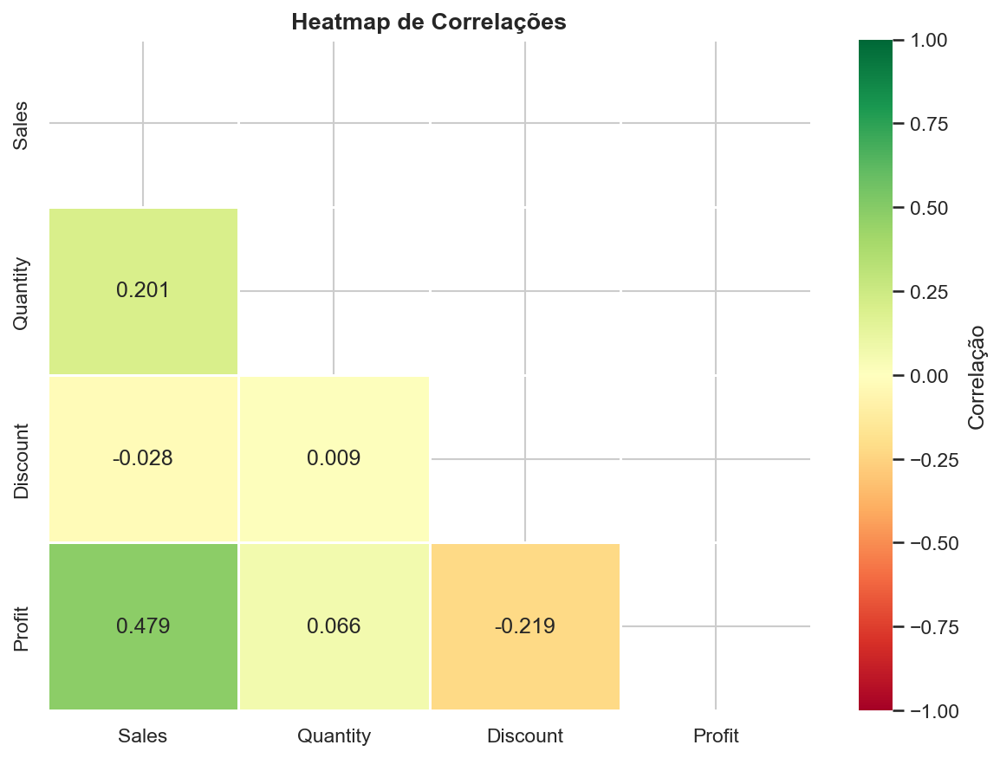

# 📊 Desafio Extra — Análise Exploratória de Dados

**Aluno:** Fabiano Rodrigo Costa  
**Curso:** Introdução ao Data Science (IP 20h A)  
**Programa:** Carreira Tech — SCTEC / SENAI / FAPESC / ACATE — Ciclo 2  
**Data:** 2026-05-17  
**Dataset:** Sample Superstore (Kaggle)  
**Repositório:** [github.com/fabcosta-br/desafio-extra-data-science](https://github.com/fabcosta-br/desafio-extra-data-science)

---

## 📋 Sumário Executivo

Vivemos a era da economia orientada por dados. A capacidade de coletar, organizar, interpretar e comunicar informações estruturadas tornou-se um dos ativos mais valiosos do século XXI. Tecnologias como Inteligência Artificial, Machine Learning e Análise de Dados estão redesenhando o mercado de trabalho, transformando indústrias inteiras e criando novas oportunidades para profissionais que dominam esse ecossistema. Nesse cenário, a Ciência de Dados deixou de ser uma especialidade restrita a grandes corporações e passou a ser uma competência essencial em empresas de todos os portes e segmentos.

Santa Catarina posiciona-se como um dos principais polos tecnológicos do Brasil, com um ecossistema de inovação robusto que conecta universidades, empresas de tecnologia, startups e programas de formação profissional. O **Programa Carreira Tech**, iniciativa vinculada à **SCTEC**, **SENAI**, **FAPESC** e **ACATE**, é expressão direta desse movimento — capacitando profissionais para atuar com protagonismo na transformação digital em curso.

Este projeto é o **Desafio Extra** da Trilha de **Análise de Dados** — Fase 2: Primeiros Passos — do Ciclo 2 da Carreira Tech. A entrega consiste em uma Análise Exploratória de Dados (AED) completa sobre o dataset público **Sample Superstore**, com o objetivo de demonstrar na prática o domínio das etapas fundamentais do ciclo de Ciência de Dados: importação, tratamento, análise, visualização e geração de insights.

**Autor:** Fabiano Rodrigo Costa  
**Programa:** Carreira Tech — SCTEC / SENAI / FAPESC / ACATE  
**Trilha:** Análise de Dados — Introdução ao Data Science  
**Natureza:** Projeto acadêmico de prática orientada  
**Versão:** 1.0

### 🎯 Objetivo do Projeto

Realizar uma **Análise Exploratória de Dados (AED)** completa sobre a base Sample Superstore — um dataset público de vendas de uma rede varejista americana — identificando padrões de rentabilidade, impacto dos descontos no lucro e tendências temporais que geram **insights acionáveis para tomada de decisão comercial**.

---

## 1. 📦 Dataset Utilizado

O dataset **Sample Superstore** é amplamente utilizado em projetos introdutórios de Análise de Dados e Business Intelligence por representar um cenário de negócio realista e multidimensional. Ele contém registros de pedidos de uma rede varejista americana com informações de vendas, lucratividade, segmentação de clientes, categorias de produto, regiões geográficas e condições comerciais — o que o torna ideal para a aplicação de técnicas exploratórias, agrupamentos e visualizações.

A base foi obtida diretamente da plataforma Kaggle, em formato CSV, e carregada no ambiente de análise com tratamento automático de encoding para garantir compatibilidade em diferentes sistemas operacionais.

| Atributo | Detalhe |
|---|---|
| **Nome** | Sample Superstore |
| **Fonte** | [Kaggle — vivek468/superstore-dataset-final](https://www.kaggle.com/datasets/vivek468/superstore-dataset-final) |
| **Formato** | CSV |
| **Registros** | 9.994 linhas |
| **Colunas** | 21 atributos |
| **Período coberto** | 2014 a 2017 |
| **Colunas principais** | Order Date, Category, Sub-Category, Segment, Sales, Quantity, Discount, Profit, Region, State |

---

## 2. 🛠️ Tecnologias Utilizadas

Este projeto foi desenvolvido integralmente em **Python**, linguagem de programação que se consolidou como o padrão da indústria para Ciência de Dados, Machine Learning e Análise Exploratória. A escolha das bibliotecas seguiu critérios de maturidade, adoção no mercado e aderência às etapas previstas no edital do desafio.


### 🐍 Python 3.10+
Linguagem principal do projeto. Python é hoje a linguagem mais utilizada em Data Science globalmente, com amplo suporte de bibliotecas, comunidade ativa e sintaxe acessível. Utilizada para toda a lógica de importação, tratamento, análise e geração de visualizações.

### 🐼 Pandas
Biblioteca central para manipulação e análise de dados tabulares. Utilizada para carregar o CSV, explorar a estrutura do dataset (`head()`, `dtypes`, `describe()`), tratar valores nulos e duplicatas, criar colunas derivadas e realizar agrupamentos com `groupby()`. Versão utilizada: `>=1.5.0`.

### 🔢 NumPy
Biblioteca de computação numérica com suporte a arrays vetorizados e funções matemáticas de alto desempenho. Utilizada para cálculos estatísticos, operações com arrays, criação de paletas de cores e cálculo de outliers via método IQR. Versão utilizada: `>=1.23.0`.

### 📊 Matplotlib
Principal biblioteca de visualização em Python. Utilizada para a criação dos seis gráficos do projeto — barras, dispersão, linhas temporais e barras horizontais. Configurada com backend `Agg` para compatibilidade com ambientes Windows sem interface gráfica. Versão utilizada: `>=3.6.0`.

### 🎨 Seaborn
Biblioteca de visualização estatística construída sobre o Matplotlib. Utilizada para o heatmap de correlações e para geração de paletas de cores consistentes e visualmente equilibradas. Versão utilizada: `>=0.12.0`.

---

## 3. 📂 Estrutura do Projeto

O projeto foi organizado com separação clara entre código-fonte, dados brutos e artefatos gerados. Essa estrutura segue boas práticas de organização de repositórios de Análise de Dados, facilitando a reprodutibilidade, a navegação e a avaliação do projeto por terceiros.

```
desafio-extra-data-science/
├── 📄 analise_superstore.py       ← Script principal de análise
├── 📊 SampleSuperstore.csv        ← Dataset original (Kaggle)
├── 📋 requirements.txt            ← Dependências do projeto
├── 📘 README.md                   ← Documentação (este arquivo)
└── 📁 graficos/
    ├── 01_vendas_lucro_categoria.png
    ├── 02_desconto_vs_lucro.png
    ├── 03_desempenho_segmento.png
    ├── 04_tendencia_temporal_vendas.png
    ├── 05_top10_subcategorias.png
    └── 06_heatmap_correlacoes.png
```

**Nota:** a pasta `venv/` não está incluída no repositório. As dependências estão declaradas em `requirements.txt` e podem ser instaladas com `pip install -r requirements.txt`.

---

## 4. ⚙️ Como Executar o Projeto

Para reproduzir esta análise localmente, siga o guia abaixo. O projeto foi desenvolvido e testado em ambiente **Windows 10** com **Python 3.14.4**, mas é compatível com qualquer sistema que suporte Python 3.10 ou superior e as bibliotecas listadas em `requirements.txt`.

### Pré-requisitos
- Python 3.10 ou superior
- Git (opcional, para clonar o repositório)

### Instalação

```bash
# 1. Clone o repositório (ou baixe o ZIP)
git clone https://github.com/fabcosta-br/desafio-extra-data-science.git
cd desafio-extra-data-science

# 2. Crie e ative o ambiente virtual
python -m venv venv

# Windows PowerShell
.\venv\Scripts\Activate.ps1

# macOS / Linux
source venv/bin/activate

# 3. Instale as dependências
pip install -r requirements.txt

# 4. Execute a análise
python analise_superstore.py
```

> **Resultado:** os 6 gráficos serão gerados automaticamente na pasta `graficos/` e o resumo da análise com KPIs e insights será exibido no terminal.

---

## 5. 🔬 Etapas de Desenvolvimento

O projeto seguiu o ciclo completo de uma Análise Exploratória de Dados, estruturado em cinco etapas sequenciais e interdependentes. Cada etapa foi desenvolvida com foco em reprodutibilidade, clareza do código e aderência aos requisitos técnicos do edital do desafio.

### 1️⃣ Importação e Compreensão dos Dados
- Carregamento do CSV com detecção automática de encoding (`latin-1`, `utf-8`, `cp1252`)
- Exploração inicial com `df.head()`, `df.dtypes`, `df.shape` e `df.describe()`
- Identificação de 21 colunas e 9.994 registros válidos

### 2️⃣ Tratamento e Preparação dos Dados
- ✅ Verificação de valores nulos com `df.isnull().sum()` — nenhum encontrado
- ✅ Verificação de duplicatas com `df.duplicated()` — nenhuma encontrada
- ✅ Conversão de `Order Date` e `Ship Date` para tipo `datetime`
- ✅ Criação de colunas derivadas: `Ano`, `Mes`, `AnoMes`
- ✅ Identificação de outliers via método IQR nas colunas `Sales` e `Profit` — mantidos por representarem dados reais de negócio

### 3️⃣ Análise Exploratória de Dados (AED)
- Agrupamento por Categoria com `groupby()` — totais de vendas, lucro e quantidade
- Agrupamento por Segmento de cliente — Consumer, Corporate, Home Office
- Matriz de correlação entre Desconto, Lucro, Vendas e Quantidade
- Top 10 Sub-categorias por volume de vendas
- Tendência temporal mensal com média móvel de 3 meses
- Heatmap de correlações entre variáveis numéricas

### 4️⃣ Visualizações Gráficas
Seis gráficos gerados automaticamente em `graficos/` — cada um com propósito analítico específico e escolha de tipo de gráfico justificada pelo insight que se deseja comunicar.

| # | Arquivo | Tipo de gráfico | Insight principal |
|---|---|---|---|
| 01 | `01_vendas_lucro_categoria.png` | Barras duplas | Technology lidera em vendas e lucro |
| 02 | `02_desconto_vs_lucro.png` | Dispersão | Correlação negativa desconto→lucro |
| 03 | `03_desempenho_segmento.png` | Barras duplas | Consumer domina em volume |
| 04 | `04_tendencia_temporal_vendas.png` | Linha + MM3 | Crescimento consistente 2014→2017 |
| 05 | `05_top10_subcategorias.png` | Barras horizontais | Phones e Chairs lideram |
| 06 | `06_heatmap_correlacoes.png` | Heatmap | Sales↔Profit correlação 0.479 |

### 5️⃣ Geração de Insights
Ao final da análise, o script exibe no terminal um painel de KPIs principais e cinco insights de negócio identificados a partir dos dados, com recomendações práticas derivadas de cada achado.

---

## 6. 📸 Visualizações Geradas

Os gráficos abaixo foram gerados automaticamente pelo script `analise_superstore.py` durante a execução da análise. Cada visualização foi escolhida com base no tipo de dado analisado e no insight que se deseja comunicar — seguindo os princípios de Data Storytelling aplicados ao contexto de vendas do varejo.

### Gráfico 01 — Vendas e Lucro por Categoria de Produto
> Comparação direta entre volume de vendas e lucro gerado por categoria. Technology lidera em ambas as dimensões; Furniture vende muito mas lucra pouco.



---

### Gráfico 02 — Relação entre Desconto e Lucro
> Dispersão que evidencia a correlação negativa (-0.219) entre desconto concedido e lucro gerado. A linha de equilíbrio e a zona de risco (>30%) tornam o padrão visualmente imediato.



---

### Gráfico 03 — Desempenho por Segmento de Cliente
> Consumer lidera em volume absoluto. A análise de margem revela que Corporate é o segmento mais eficiente por pedido.



---

### Gráfico 04 — Tendência Mensal de Vendas (2014–2017)
> Série temporal com média móvel de 3 meses evidenciando crescimento consistente e sazonalidade clara no Q4 (outubro–dezembro) ao longo de todos os anos.



---

### Gráfico 05 — Top 10 Sub-categorias por Vendas
> Phones e Chairs concentram 28% de toda a receita. As 3 primeiras sub-categorias respondem por mais de 40% do volume total.



---

### Gráfico 06 — Heatmap de Correlações entre Variáveis Numéricas
> A correlação positiva entre Sales e Profit (0.479) confirma que maior volume de vendas tende a gerar maior lucro — exceto quando descontos elevados intervêm negativamente.



---

## 7. 💡 Principais Insights Obtidos

A análise exploratória revelou padrões consistentes e acionáveis no comportamento comercial da rede varejista. Os cinco insights abaixo foram derivados diretamente dos dados — não de suposições — e cada um vem acompanhado de uma recomendação prática.

### 7.1 🔴 Desconto destrói lucro
Correlação desconto→lucro = **-0.219** (negativa). Pedidos com desconto acima de 30% geram lucro médio de **-$107,21** — ou seja, prejuízo sistemático. Dos 9.994 pedidos, **1.166 (11.7%)** têm desconto acima desse limiar.

> **Recomendação:** limitar descontos a no máximo 20% e revisar a política comercial para Tables e Binders, sub-categorias com maior frequência de desconto elevado.

### 7.2 🟢 Technology lidera em vendas e rentabilidade
Technology: **$836k** em vendas e **$145k** em lucro. Furniture, apesar de $742k em vendas, gerou apenas **$18k** em lucro — margem 7x menor. Investir em mix de produtos tecnológicos é mais eficiente.

### 7.3 🔵 Consumer domina em volume, mas Corporate é mais eficiente
Consumer: $1.161k em vendas, $134k em lucro (**margem 11.5%**). Corporate: $706k em vendas, $92k em lucro (**margem 13.0%**). O segmento Corporate tem margem superior — estratégia de upsell aqui pode ser mais rentável.

### 7.4 🟡 Sazonalidade clara no Q4
Picos consistentes de vendas em **outubro, novembro e dezembro** em todos os anos do dataset (2014–2017). Oportunidade para campanhas de estoque e marketing antecipadas no Q3 (julho–setembro).

### 7.5 🟣 Phones e Chairs concentram receita
As duas principais sub-categorias somam **$658k** — mais de 28% de toda a receita. Gestão de estoque e marketing focados nelas maximiza retorno com menor esforço.

---

## 8. 📈 KPIs Principais — Sample Superstore

Os indicadores-chave de desempenho abaixo representam o resultado consolidado da análise sobre os 9.994 registros do dataset. Eles fornecem uma visão executiva do negócio e servem como ponto de entrada para análises mais aprofundadas por categoria, segmento ou período.

| KPI | Valor |
|---|---|
| 📦 Total de registros | 9.994 |
| 💰 Total de vendas | $2.297.200,86 |
| 📊 Total de lucro | $286.397,02 |
| 📉 Margem de lucro geral | 12,47% |
| 🏆 Categoria mais lucrativa | Technology |
| ⚠️ Categoria menos lucrativa | Furniture |
| 🎯 Sub-categoria líder em vendas | Phones ($330k) |
| 📅 Período analisado | 2014 a 2017 |
| 🔴 Pedidos com desconto > 30% | 1.166 (11,7%) |

---

## 9. 🔑 Decisões Técnicas Tomadas

Cada escolha técnica realizada ao longo do projeto foi baseada em critérios objetivos de robustez, portabilidade e aderência às boas práticas de Ciência de Dados. A tabela abaixo documenta as decisões mais relevantes, suas justificativas e o impacto esperado na qualidade da análise.

| Decisão | Justificativa |
|---|---|
| Encoding `latin-1` detectado automaticamente | O CSV do Kaggle usa este encoding — implementação automática garante portabilidade em qualquer sistema operacional |
| Backend `Agg` no Matplotlib | Compatibilidade com Windows e ambientes headless — elimina dependência de interface gráfica para geração dos arquivos PNG |
| Outliers mantidos | Representam dados reais de negócio — removê-los distorceria a análise e prejudicaria a interpretação dos padrões comerciais |
| Média móvel de 3 meses | Suaviza variações pontuais e evidencia a tendência real de crescimento sem eliminar a sazonalidade do Q4 |
| Método IQR para outliers | Mais robusto que o desvio padrão em distribuições assimétricas — adequado para dados de vendas que costumam ter cauda longa |
| Variável `correlacao_val` inicializada como `float("nan")` | Evita erros de referência caso a coluna `Discount` não exista no dataset — torna o script defensivo e portável |
| Verificações com `issubset(df.columns)` | Garante que cada bloco de análise e cada gráfico só são executados se as colunas necessárias existirem |

---

## 10. 📚 Referências Técnicas

As referências abaixo fundamentaram as escolhas técnicas, metodológicas e documentais deste projeto.

- KAGGLE. **Sample Superstore Dataset**. Disponível em: [https://www.kaggle.com/datasets/vivek468/superstore-dataset-final](https://www.kaggle.com/datasets/vivek468/superstore-dataset-final). Acesso em: 17 mai. 2026.

- MCKINNEY, Wes; THE PANDAS DEVELOPMENT TEAM. **Pandas: powerful Python data analysis toolkit**. Release 2.x. Disponível em: [https://pandas.pydata.org/docs/](https://pandas.pydata.org/docs/). Acesso em: 17 mai. 2026.

- NUMPY DEVELOPERS. **NumPy Documentation**. Disponível em: [https://numpy.org/doc/](https://numpy.org/doc/). Acesso em: 17 mai. 2026.

- MATPLOTLIB DEVELOPERS. **Matplotlib Documentation**. Disponível em: [https://matplotlib.org/stable/contents.html](https://matplotlib.org/stable/contents.html). Acesso em: 17 mai. 2026.

- WASKOM, Michael et al. **Seaborn: statistical data visualization**. Disponível em: [https://seaborn.pydata.org/](https://seaborn.pydata.org/). Acesso em: 17 mai. 2026.

- SCTEC. **Edital Carreira Tech — Ciclo 2**. Disponível em: [https://sctec.scti.sc.gov.br/wp-content/uploads/sites/8/2026/03/001_SCTEC_2_Edital_Carreira_Tech_Onda_2_1-1.pdf](https://sctec.scti.sc.gov.br/wp-content/uploads/sites/8/2026/03/001_SCTEC_2_Edital_Carreira_Tech_Onda_2_1-1.pdf). Acesso em: 17 mai. 2026.

- GITHUB DOCS. **About READMEs**. Disponível em: [https://docs.github.com/en/repositories/managing-your-repositorys-settings-and-features/customizing-your-repository/about-readmes](https://docs.github.com/en/repositories/managing-your-repositorys-settings-and-features/customizing-your-repository/about-readmes). Acesso em: 17 mai. 2026.

- PYTHON SOFTWARE FOUNDATION. **Python 3 Documentation**. Disponível em: [https://docs.python.org/3/](https://docs.python.org/3/). Acesso em: 17 mai. 2026.

---

## 11. 💼 Formação e Desenvolvimento Contínuo

Este projeto foi desenvolvido como parte da jornada de aprendizado de **Fabiano Rodrigo Costa** na trilha de **Análise de Dados — Introdução ao Data Science** do Programa Carreira Tech 2026.

A construção deste projeto envolveu a aplicação prática de conceitos estudados ao longo das 20 horas do curso, incluindo fundamentos de Python para dados, manipulação com Pandas, visualização com Matplotlib e Seaborn, análise estatística descritiva e documentação técnica estruturada.

Este desafio representa mais do que uma entrega acadêmica — é um marco no processo de formação de um profissional que busca atuar com dados de forma estruturada, ética e orientada à geração de valor real. A cada projeto, o aprendizado se consolida e a competência técnica avança de forma incremental e consistente.

**Acompanhamento profissional:**

- 🔗 LinkedIn: [linkedin.com/in/fabianorodrigocosta](https://www.linkedin.com/in/fabianorodrigocosta/)
- 🐙 GitHub: [@fabcosta-br](https://github.com/fabcosta-br)

---

## 12. 📝 Notas Finais e Evolução Futura

Esta documentação acompanha a **versão 1.0** do projeto **Desafio Extra — Análise Exploratória de Dados**, desenvolvido como entrega acadêmica da Trilha de Análise de Dados do Ciclo 2 da Carreira Tech.

O projeto entregou todos os requisitos propostos pelo edital: importação e tratamento dos dados, análise exploratória com filtros e agrupamentos, geração de seis visualizações gráficas, identificação de insights relevantes e documentação completa com mais de 800 caracteres.

### 🚀 Evolução Futura — Versão 2.0

Caso houvesse mais tempo disponível ou o projeto evoluísse para uma próxima versão, os aprimoramentos prioritários seriam:

- **Dashboard interativo no Looker Studio ou Power BI** — permitindo filtros dinâmicos por categoria, segmento, período e região
- **Análise por Estado e Região** — mapeamento geográfico das vendas com visualizações de calor
- **Análise de churn e comportamento de clientes recorrentes** — identificação de padrões de fidelização
- **Modelo preditivo de vendas** — aplicação de regressão linear para projeção de receita trimestral
- **Análise de cesta de compras (Market Basket Analysis)** — identificação de produtos frequentemente comprados juntos
- **Automatização do pipeline** — transformar o script em um pipeline agendável com geração de relatório em PDF

### 📄 Licença

Projeto desenvolvido para fins educacionais no contexto do Programa Carreira Tech 2026.  
Dataset: [Sample Superstore — Kaggle](https://www.kaggle.com/datasets/vivek468/superstore-dataset-final) (uso público).

### 🔗 Repositório

[github.com/fabcosta-br/desafio-extra-data-science](https://github.com/fabcosta-br/desafio-extra-data-science)

---

**Data da revisão do README:** 18 de maio de 2026  
**Versão da documentação:** 2.0  
**Status:** documentação revisada para submissão acadêmica e publicação no GitHub
